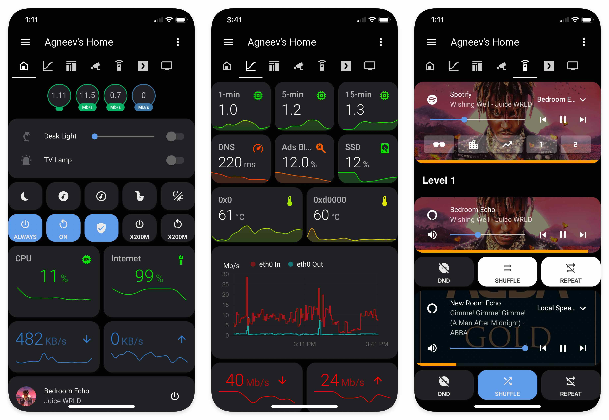
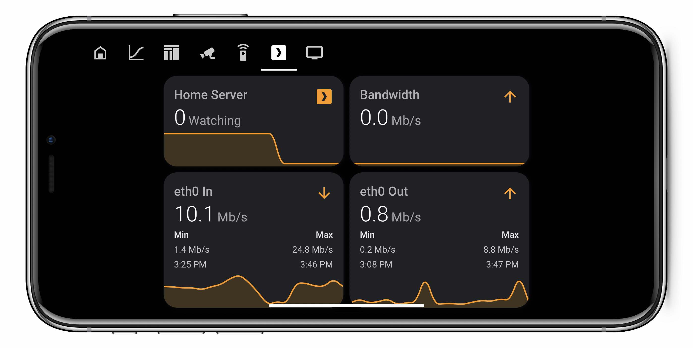

<!-- markdownlint-disable MD024 -->
# My Home Assistant setup

This layout was designed mobile-first.

## Background

Home Assistant is running in a Python `venv` on a Raspberry Pi 4 (4GB), with an SSD (Crucial MX500).

## Lovelace layout

## Dashboard (home view)

All cards in this view are in a vertical stack...

### [Badges](https://github.com/agneevX/my-ha-setup/blob/readme-overhaul/lovelace_raw.yaml#L10)

* System Load
* HACS available updates
* Network In
* Network Out
* mergerFS free %

*This is the only view that contain badges.*

  <b>Vertical stack 1</b>

### [Switch card](https://github.com/agneevX/my-ha-setup/blob/readme-overhaul/lovelace_raw.yaml#L34)

* Desk Lamp
* TV Lamp

### [Switch row I](https://github.com/agneevX/my-ha-setup/blob/readme-overhaul/lovelace_raw.yaml#L51)

* Night Lamp switch
* Color Flow switch
* Lo-Fi Beats switch
* Lo-Fi Beats 2 switch
* Jazz Radio switch

### [Switch row II](https://github.com/agneevX/my-ha-setup/blob/readme-overhaul/lovelace_raw.yaml#L124)

* AdGuard Home switch
* Reboot `Always-On Server`
* Refresh Plex switch
* Circadian Lighting switch
* Shut Down/Restart X200M (secondary laptop)

  <b>Vertical stack 2</b>

### [Graph row I](https://github.com/agneevX/my-ha-setup/blob/readme-overhaul/lovelace_raw.yaml#L209)

* CPU use
* Network health

### [Graph row II](https://github.com/agneevX/my-ha-setup/blob/readme-overhaul/lovelace_raw.yaml#L276)

* Hidden/conditional qBittorrent download card
* Hidden/conditional qBittorrent upload card

### [Now Playing card](https://github.com/agneevX/my-ha-setup/blob/readme-overhaul/lovelace_raw.yaml#L451)

* Automatically shows all active media players

***

## Info view

Two vertical stacks in this view.

  <b>Vertical stack 1</b>

### [Graph row I](https://github.com/agneevX/my-ha-setup/blob/readme-overhaul/lovelace_raw.yaml#L472)

* System Load - 5 minutes
* SSD used %
* Google Drive used space

### [Graph row II](https://github.com/agneevX/my-ha-setup/blob/readme-overhaul/lovelace_raw.yaml#L565)

* AdGuard Home - % of blocked ads
* AdGuard Home processing speed
* Latency - Speedtest.net

### [Graph row III](https://github.com/agneevX/my-ha-setup/blob/readme-overhaul/lovelace_raw.yaml#L657)

* CPU Temperature/Throttled state (host)
* CPU Temperature/Throttled state (Always-On server)
* Jitter - Speedtest.net

### [Graph row IV](https://github.com/agneevX/my-ha-setup/blob/readme-overhaul/lovelace_raw.yaml#L736)

* Download speed
* Upload speed

This is a custom sensor that uses the official Speedtest CLI as opposed to the `speedtest-cli` integration, which is very inaccurate.

  <b>Vertical stack 2</b>

### [Network throughput card](https://github.com/agneevX/my-ha-setup/blob/readme-overhaul/lovelace_raw.yaml#L806)

* Graphs network usage in the last hour

### [Network traffic card](https://github.com/agneevX/my-ha-setup/blob/readme-overhaul/lovelace_raw.yaml#L833)

* Total data in
* Total data out

This is another custom sensor that gets daily network usage from `vnstat` instead of using the rather [buggy](https://github.com/home-assistant/core/issues/34804) internal integration.

### [Sensor graph](https://github.com/agneevX/my-ha-setup/blob/readme-overhaul/lovelace_raw.yaml#L867)

Pings my local ISP node and Cloudflare DNS. Very helpful in isolating network issues.

***

## Tile view

  <b>Vertical stack 1</b>

### [Specific devices tracking card](https://github.com/agneevX/my-ha-setup/blob/readme-overhaul/lovelace_raw.yaml#L882)

### Radarr/Sonarr cards

* [Radarr/Sonarr ongoing commands](https://github.com/agneevX/my-ha-setup/blob/readme-overhaul/lovelace_raw.yaml#L970)
* [Radarr/Sonarr Upcoming](https://github.com/agneevX/my-ha-setup/blob/readme-overhaul/lovelace_raw.yaml#L1022)
* [Sonarr Queue/Wanted](https://github.com/agneevX/my-ha-setup/blob/readme-overhaul/lovelace_raw.yaml#L1060)
* [Radarr Movies/Sonarr Shows](https://github.com/agneevX/my-ha-setup/blob/readme-overhaul/lovelace_raw.yaml#L1098)

  <b>Vertical stack 2</b>

### [Router devices](https://github.com/agneevX/my-ha-setup/blob/readme-overhaul/lovelace_raw.yaml#L1138)

Using the Netgear integration, this card shows all devices that are/were connected to my router.
Shows the last updated device on top.

***

## [Camera view](https://github.com/agneevX/my-ha-setup/blob/readme-overhaul/lovelace_raw.yaml#L1159)

This view contains one vertical stack only.

***

### Remote control view

This view contains one vertical stack only.

### [Spotify card](https://github.com/agneevX/my-ha-setup/blob/readme-overhaul/lovelace_raw.yaml#L1182)

#### [Header card](https://github.com/agneevX/my-ha-setup/blob/readme-overhaul/lovelace_raw.yaml#L1211)

### [Media player cards for Alexa devices](https://github.com/agneevX/my-ha-setup/blob/readme-overhaul/lovelace_raw.yaml#L1228)

***

## Plex view

All cards in this view are in a single vertical stack.

These two graph rows provide an overview of network activity and helps track if a Plex client is buffering.

### [Graph row I](https://github.com/agneevX/my-ha-setup/blob/readme-overhaul/lovelace_raw.yaml#L1287)

* Plex Watching sensor
* Tautulli current bandwidth

### [Graph row II](https://github.com/agneevX/my-ha-setup/blob/readme-overhaul/lovelace_raw.yaml#L1342)

* Network In sensor
* Network Out sensor

### Media player cards

* [Conditional header cards with Plex media player cards](https://github.com/agneevX/my-ha-setup/blob/readme-overhaul/lovelace_raw.yaml#L1396)

***

## Television view

### [TV media player cards](https://github.com/agneevX/my-ha-setup/blob/readme-overhaul/lovelace_raw.yaml#L1651)

* Header card for floors
* TV media player cards

***

### Custom plugins

#### Custom Components

* [`HACS`](https://github.com/hacs/integration) by [ludeeus](https://github.com/ludeeus)
* [`Alexa Media Player`](https://github.com/custom-components/alexa_media_player)
* [`Circadian Lighting`](https://github.com/claytonjn/hass-circadian_lighting) by [claytonjn](https://github.com/claytonjn)

#### Lovelace

* [`card-mod`](https://github.com/thomasloven/lovelace-card-mod) by [thomasloven](https://github.com/thomasloven)
* [`mini-graph-card`](https://github.com/kalkih/mini-graph-card) by [kalkih](https://github.com/kalkih)
* [`mini-media-player`](https://github.com/kalkih/mini-media-player) by kalkih
* [`slider-entity-row`](https://github.com/thomasloven/lovelace-slider-entity-row) by thomasloven
* [`state-switch`](https://github.com/thomasloven/lovelace-state-switch) by thomasloven
* [`auto-entities`](https://github.com/thomasloven/lovelace-auto-entities) by thomasloven
* [`slider-entity-row`](https://github.com/iantrich/config-template-card) by [iantrich](https://github.com/iantrich)
* [`custom-header`](https://github.com/maykar/custom-header) by [maykar](https://github.com/maykar)
* [`lovelace-swipe-navigation`](https://github.com/maykar/lovelace-swipe-navigation) by maykar
* [`button-card`](https://github.com/custom-cards/button-card)
* [`config-template-card`](https://github.com/iantrich/config-template-card) by maykar

***

## Notes

* Screenshots may not be up-to-date.
* Entities beginning with `int` are "internal" entities that are used inside templates.
* Shutting down/Rebooting X200M involves a program called `Assistant Computer Control` that runs on the laptop.
  The cURL request calls a IFTTT webhook which in turn writes a specific word in a file inside OneDrive that the software is able to recognize and perform actions accordingly.
* The header that is used for separating cards is from the theme, [soft-ui](https://github.com/N-l1/lovelace-soft-ui).

***

## Special thanks

* to all authors above,
* and all the very helpful folks over at the HA Discord.

